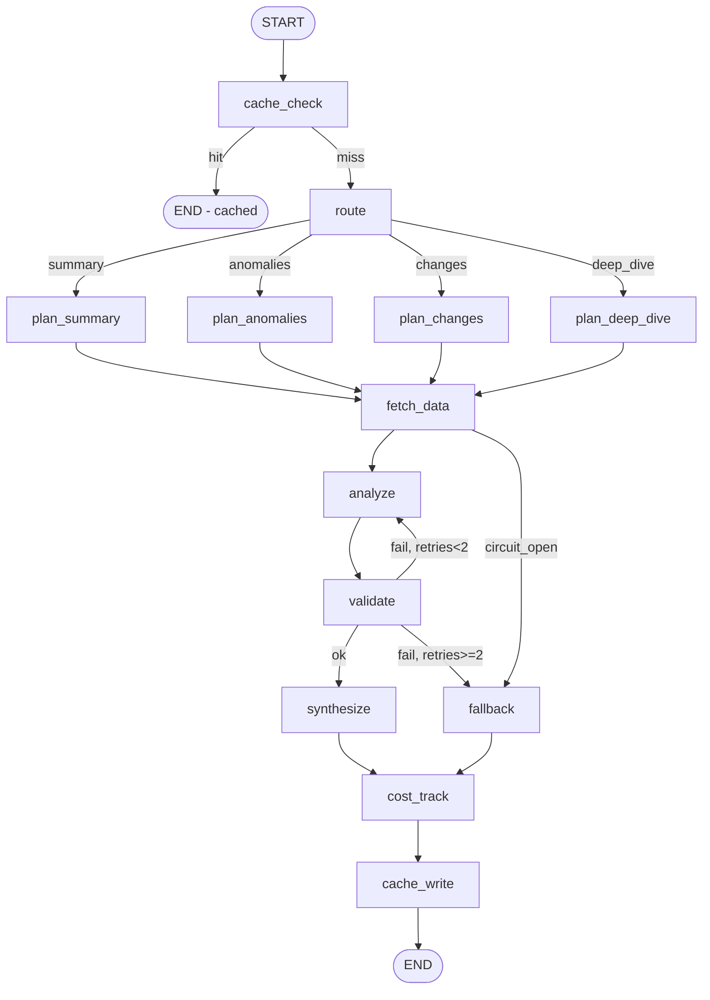

# LangGraph Fortification of DataPulse AI Light — Plan

> **Status:** Approved plan — ready for implementation
> **Branch:** `claude/nostalgic-benz`
> **Scope:** Introduce LangGraph as the orchestration engine behind the existing 4 `ai_light` endpoints (zero frontend breaking changes) and add a new composite `/deep-dive` endpoint with tool use, validation retries, caching, cost tracking, and optional human-in-the-loop.

---

## 1. Context

The current `ai_light` module (527 LOC of code + 804 LOC of tests) is a linear, single-shot LLM wrapper. Each insight type (summary, anomalies, changes) makes exactly one set of DB queries, formats a prompt, calls OpenRouter once, and parses the output. This is acceptable for simple summaries but has **10 structural gaps** that limit reliability, cost efficiency, and analytical depth:

1. No caching of AI outputs — duplicate requests cost double.
2. No multi-step reasoning or tool use — the LLM cannot decide what data to fetch.
3. No cross-domain integration — `ai_light`, `forecasting`, `anomalies`, `targets` are isolated silos.
4. Output validation limited to `json.loads` — no schema enforcement or retry.
5. Constant 1s backoff with no circuit breaker.
6. No token usage tracking or cost caps.
7. No async streaming for long operations.
8. No human-in-the-loop gates.
9. No prompt versioning or A/B.
10. No observability across multi-step flows.

**Solution:** Introduce **LangGraph** as the orchestration engine *behind* the existing endpoints (so the frontend sees no breaking change) and add a new composite `/deep-dive` endpoint that orchestrates KPIs → anomalies → forecast → narrative in one agentic graph.

---

## 2. Architecture



Phase D adds `interrupt_before=["synthesize"]` + `/review/{run_id}` resume endpoint.

**Module location decision:** new code lives under `src/datapulse/ai_light/graph/` — co-located with the existing service (avoids renaming imports; does not collide with the unrelated `src/datapulse/graph/` code-analysis MCP server).

---

## 3. State Schema

`src/datapulse/ai_light/graph/state.py` — `AILightState(TypedDict, total=False)`:

| Category | Keys |
|---|---|
| **Identity** | `tenant_id`, `user_claims`, `run_id` (UUID) |
| **Request** | `insight_type` (summary \| anomalies \| changes \| deep_dive), `target_date`, `start_date`, `end_date`, `params_hash`, `use_langgraph` |
| **Fetched data** | `kpi_data`, `daily_trend`, `monthly_trend`, `top_products`, `top_customers`, `anomaly_alerts`, `forecast_summary`, `target_vs_actual`, `churn_predictions` |
| **Analysis** | `statistical_analysis`, `llm_raw_output`, `llm_parsed_output` |
| **Outputs** | `narrative`, `highlights`, `anomalies_list`, `deltas`, `degraded` (bool) |
| **Cost / obs** | `token_usage {input, output, total}`, `cost_cents`, `model_used`, `step_trace` (append reducer), `errors` |
| **Control** | `validation_retries`, `circuit_breaker_failures`, `cache_hit` |

No `add_messages` reducer — this is not a chatbot. LLM calls are single-shot inside nodes. `step_trace` uses a custom append reducer for node-execution records.

---

## 4. Tool Registry (v1 — 15 tools)

Closure-bound to the per-request tenant-scoped session. Each tool returns `dict` (`.model_dump(mode="json")`). `@tool` auto-generates the `args_schema` from type hints.

| # | Tool | Wraps | Source |
|---|------|-------|--------|
| 1 | `get_kpi_summary` | `AnalyticsRepository.get_kpi_summary(date)` | `analytics/repository.py:117` |
| 2 | `get_daily_trend` | `AnalyticsRepository.get_daily_trend(filters)` | `analytics/trend_repository.py:34` |
| 3 | `get_monthly_trend` | `AnalyticsRepository.get_monthly_trend(filters)` | `analytics/trend_repository.py:56` |
| 4 | `get_top_products` | `AnalyticsRepository.get_top_products(filters)` | `analytics/ranking_repository.py:99` |
| 5 | `get_top_customers` | `AnalyticsRepository.get_top_customers(filters)` | `analytics/ranking_repository.py:159` |
| 6 | `get_top_staff` | `AnalyticsRepository.get_top_staff(filters)` | `analytics/ranking_repository.py:169` |
| 7 | `get_site_performance` | `AnalyticsService.get_site_comparison(filters)` | `analytics/ranking_repository.py:234` |
| 8 | `get_top_gainers` | `AnalyticsService.get_top_movers(direction="up")` | `analytics/comparison_repository.py` |
| 9 | `get_top_losers` | `AnalyticsService.get_top_movers(direction="down")` | `analytics/comparison_repository.py` |
| 10 | `get_active_anomaly_alerts` | `AnomalyService.get_active_alerts(limit)` | `anomalies/service.py:144` |
| 11 | `get_revenue_forecast` | `ForecastingService.get_revenue_forecast()` | `forecasting/service.py:41` |
| 12 | `get_forecast_summary` | `ForecastingService.get_forecast_summary()` | `forecasting/service.py:51` |
| 13 | `get_customer_segments` | `ForecastingService.get_customer_segments()` | `forecasting/service.py:95` |
| 14 | `get_target_vs_actual` | `TargetsService.get_target_summary(year)` | `targets/service.py:57` |
| 15 | `get_churn_risk` | `ChurnRepository.get_risk_distribution()` | `analytics/churn_repository.py:40` |

---

## 5. Node Specifications

| Node | Input State Keys | Output State Keys | Description |
|------|------------------|-------------------|-------------|
| `cache_check` | `tenant_id`, `insight_type`, `params_hash` | `cache_hit`, pre-populated outputs if hit | Redis lookup on `ai_light:{tenant_id}:{insight_type}:{params_hash}:{data_version}` |
| `route` | `insight_type` | (routing only) | Conditional edge to type-specific plan node |
| `plan_summary` | `insight_type`, `target_date` | `step_trace` (append) | Plan: KPI + top products + top customers |
| `plan_anomalies` | dates | `step_trace` (append) | Plan: daily trend + active alerts |
| `plan_changes` | dates | `step_trace` (append) | Plan: KPIs for both periods + top movers |
| `plan_deep_dive` | dates | `step_trace` | ReAct tool-use loop (LLM decides which tools) |
| `fetch_data` | plan | data keys (kpi_data, trends, …) | Executes tool calls (deterministic for 3 legacy types; ReAct for deep_dive) |
| `analyze` | all fetched data | `statistical_analysis`, `llm_raw_output`, `llm_parsed_output`, `token_usage`, `model_used` | Stats (mean/std/z-score) + LLM narrative |
| `validate` | `llm_parsed_output`, `insight_type`, `validation_retries` | `validation_retries++`, `errors` | Pydantic schema check; retry edge to `analyze` (max 2) |
| `fallback` | `statistical_analysis`, `insight_type` | `narrative`, `highlights`, `degraded=True` | Stats-only narrative if LLM fails |
| `synthesize` | `llm_parsed_output`, `statistical_analysis` | `narrative`, `highlights`, `anomalies_list`, `deltas`, `degraded=False` | Final response composition |
| `cost_track` | token / cost / model / run_id | (side-effect: DB write) | Insert into `ai_invocations` |
| `cache_write` | tenant + params + outputs | (side-effect: Redis write) | TTL: summary/changes 300s, anomalies 600s, deep_dive 900s |

---

## 6. Files to Create

All paths relative to worktree root.

| File | Purpose |
|------|---------|
| `src/datapulse/ai_light/graph/__init__.py` | Package init — exports `build_graph`, `AILightState` |
| `src/datapulse/ai_light/graph/state.py` | `AILightState` TypedDict + `step_trace` append reducer |
| `src/datapulse/ai_light/graph/tools.py` | `build_tool_registry(session, settings) -> list[BaseTool]` |
| `src/datapulse/ai_light/graph/nodes.py` | All node functions |
| `src/datapulse/ai_light/graph/edges.py` | `route_by_type`, `validate_or_retry`, `circuit_breaker_check` |
| `src/datapulse/ai_light/graph/builder.py` | `build_graph(settings) -> CompiledGraph` (compiled once at startup) |
| `src/datapulse/ai_light/graph/schemas.py` | `SummaryOutput`, `AnomalyOutput`, `ChangesOutput`, `DeepDiveOutput` |
| `src/datapulse/ai_light/graph/prompts.py` | V2 prompts + `PROMPT_VERSION` constant |
| `src/datapulse/ai_light/graph/cost.py` | Token→cost map, daily cap checker, `write_invocation_row()` |
| `src/datapulse/ai_light/graph_service.py` | `AILightGraphService` — same 3-method interface as `AILightService` |
| `migrations/049_create_ai_invocations.sql` | See §8 |
| `tests/test_ai_light_graph_state.py` | State + reducers |
| `tests/test_ai_light_graph_nodes.py` | Each node in isolation |
| `tests/test_ai_light_graph_tools.py` | Tool registry |
| `tests/test_ai_light_graph_integration.py` | Full graph with mocked LLM |
| `tests/test_ai_light_graph_contract.py` | Old endpoints return identical shape |

---

## 7. Files to Modify

| File | Lines | Change |
|------|-------|--------|
| `src/datapulse/core/config.py` | 112–114 | Add `ai_light_use_langgraph: bool = False`, `ai_light_max_tokens_per_day: int = 100_000`, `ai_light_checkpoint_backend: str = "memory"`, `openrouter_agent_model: str = ""`, `langsmith_api_key: str = ""`, `langsmith_project: str = ""` |
| `src/datapulse/api/deps.py` | 190–196 | `get_ai_light_service` — conditional return based on `settings.ai_light_use_langgraph`; lazy-import `AILightGraphService` |
| `src/datapulse/api/routes/ai_light.py` | 24–88 | Add `POST /api/v1/ai-light/deep-dive`; Phase D adds `GET /review/{run_id}` + `POST /approve` |
| `src/datapulse/ai_light/models.py` | 1–77 | Add `DeepDiveResponse`, `AIInsightMeta(run_id, model, tokens, cost_cents, degraded, duration_ms)` |
| `src/datapulse/ai_light/client.py` | 52–77 | Replace constant 1s backoff with exponential + jitter (`min(2**attempt + rand(0, 0.5), 8)`); add circuit breaker (3 fails → open 60s → half-open) |
| `src/datapulse/ai_light/__init__.py` | all | Export `AILightService`, `AILightGraphService`, `build_graph` |
| `pyproject.toml` | optional-deps | Add `[ai]` extras: `langgraph>=0.2,<1`, `langchain-openai>=0.2,<1`, `langgraph-checkpoint-postgres>=2,<3` |

**Dependency choice:** `langchain-openai` (not `langchain-anthropic`) — OpenRouter is OpenAI-compatible; configure with `base_url="https://openrouter.ai/api/v1"`.

**Interface contract:** both `AILightService` and `AILightGraphService` implement:

```python
class AILightServiceProtocol(Protocol):
    @property
    def is_available(self) -> bool: ...
    def generate_summary(self, target_date: date | None = None) -> AISummary: ...
    def detect_anomalies(self, start_date: date | None = None, end_date: date | None = None) -> AnomalyReport: ...
    def explain_changes(self, current_date: date | None = None, previous_date: date | None = None) -> ChangeNarrative: ...
```

---

## 8. Migration — `049_create_ai_invocations.sql`

```sql
-- Migration: 049 – AI invocation tracking for cost & observability
-- Layer: infrastructure
-- Idempotent.

CREATE TABLE IF NOT EXISTS public.ai_invocations (
    id            BIGINT GENERATED ALWAYS AS IDENTITY PRIMARY KEY,
    tenant_id     INT NOT NULL DEFAULT 1,
    run_id        UUID NOT NULL,
    insight_type  TEXT NOT NULL,           -- summary | anomalies | changes | deep_dive
    model         TEXT NOT NULL DEFAULT '',
    input_tokens  INT NOT NULL DEFAULT 0,
    output_tokens INT NOT NULL DEFAULT 0,
    cost_cents    NUMERIC(10,4) NOT NULL DEFAULT 0,
    duration_ms   INT NOT NULL DEFAULT 0,
    status        TEXT NOT NULL DEFAULT 'success'
                  CHECK (status IN ('success', 'degraded', 'error')),
    error_message TEXT,
    created_at    TIMESTAMPTZ NOT NULL DEFAULT now()
);

CREATE INDEX IF NOT EXISTS idx_ai_invocations_tenant   ON public.ai_invocations(tenant_id);
CREATE INDEX IF NOT EXISTS idx_ai_invocations_created  ON public.ai_invocations(created_at DESC);
CREATE INDEX IF NOT EXISTS idx_ai_invocations_run      ON public.ai_invocations(run_id);
CREATE INDEX IF NOT EXISTS idx_ai_invocations_type     ON public.ai_invocations(tenant_id, insight_type, created_at DESC);

ALTER TABLE public.ai_invocations ENABLE ROW LEVEL SECURITY;
ALTER TABLE public.ai_invocations FORCE  ROW LEVEL SECURITY;

DROP POLICY IF EXISTS tenant_isolation_ai_invocations ON public.ai_invocations;
CREATE POLICY tenant_isolation_ai_invocations ON public.ai_invocations
    USING (tenant_id = current_setting('app.tenant_id', true)::INT);

COMMENT ON TABLE public.ai_invocations IS
  'Tracks each AI/LLM invocation for cost monitoring and observability. RLS-protected.';
```

---

## 9. Caching Strategy

- **Key format:** `ai_light:{tenant_id}:{insight_type}:{params_hash}:{data_version}`
- `data_version` from existing `get_cache_version()` — auto-invalidated by `cache_bump_version` on pipeline completion (no explicit SCAN needed)
- `params_hash` = MD5 of sorted JSON of input params (reuse pattern at `cache_decorator.py:63`)
- **TTLs:** summary 300s, changes 300s, anomalies 600s, deep_dive 900s

---

## 10. Checkpointing Strategy

- **Phase A-C:** `MemorySaver` — graphs are short-lived single-request flows; persistence not required
- **Phase D (HITL):** `PostgresSaver` in a dedicated `ai_checkpoints` schema (kept separate from the `brain` schema which is for Claude Code session memory — different audience, different lifecycle)
- **Thread ID format:** `{tenant_id}:{insight_type}:{run_id}`

---

## 11. Phased Rollout

### Phase A — Runtime + Summary graph (3–4 days)

- Create full `ai_light/graph/` package; implement `summary` path only
- Feature flag `AI_LIGHT_USE_LANGGRAPH=false` default
- Exponential backoff + circuit breaker in `client.py` (benefits both paths)
- Migration 049 applied
- **Verify:** existing `test_ai_light*.py` all pass; with flag ON, `/summary` returns identical shape; `SELECT FROM ai_invocations` shows rows

### Phase B — Anomalies + Changes graphs (2–3 days)

- Implement `plan_anomalies`, `plan_changes`, validation schemas
- **Verify:** contract tests confirm identical response shape on all 3 endpoints; malformed-LLM injection triggers retry → fallback

### Phase C — Deep-Dive composite endpoint (3–4 days)

- `POST /api/v1/ai-light/deep-dive` with `plan_deep_dive` ReAct loop (max 5 tool iterations)
- `DeepDiveResponse` wires narrative + highlights + anomalies + forecast + deltas + degraded
- **Verify:** curl returns composite response; `ai_invocations` has multiple rows per `run_id`; circuit-breaker path tested with mocked 3× failure

### Phase D (Optional) — HITL + SSE streaming (4–5 days)

- `interrupt_before=["synthesize"]` when `require_review=True`
- `GET /review` + `POST /approve` behind `insights:approve` permission
- `PostgresSaver` for deep-dive
- SSE via `EventSourceResponse` for node-by-node progress updates

---

## 12. Testing Strategy

- **Unit per node:** pass State, assert State delta — no DB, no LLM
- **Integration:** full graph with mocked OpenRouter
- **Contract:** old 3 endpoints return identical shape with flag ON vs OFF
- **Target coverage:** 90%+ on `src/datapulse/ai_light/graph/`

```bash
pytest tests/test_ai_light*.py -v --cov=src/datapulse/ai_light --cov-report=term-missing --cov-fail-under=90
```

---

## 13. Verification Plan

```bash
# 1. Install
pip install -e ".[dev,ai]"

# 2. Migrate
psql $DATABASE_URL < migrations/049_create_ai_invocations.sql

# 3. Enable
export AI_LIGHT_USE_LANGGRAPH=true
export OPENROUTER_API_KEY=sk-or-...
export OPENROUTER_AGENT_MODEL=openai/gpt-4o-mini   # tool-capable

# 4. Run
docker compose up -d api

# 5. Smoke-test (shapes must match pre-change)
curl "localhost:8000/api/v1/ai-light/summary?target_date=2026-04-12"   -H "X-API-Key: $KEY"
curl "localhost:8000/api/v1/ai-light/anomalies?start_date=2026-03-13&end_date=2026-04-12" -H "X-API-Key: $KEY"
curl "localhost:8000/api/v1/ai-light/changes?current_date=2026-04-12&previous_date=2026-03-12" -H "X-API-Key: $KEY"

# 6. Deep-dive
curl -X POST -H 'Content-Type: application/json' -H "X-API-Key: $KEY" \
  localhost:8000/api/v1/ai-light/deep-dive \
  -d '{"insight_type":"deep_dive","start_date":"2026-03-13","end_date":"2026-04-12"}'

# 7. Cost tracking
psql $DATABASE_URL -c "SELECT run_id, insight_type, model, input_tokens+output_tokens AS total_tokens, cost_cents, status FROM public.ai_invocations ORDER BY created_at DESC LIMIT 10;"

# 8. Tests
pytest tests/test_ai_light_graph_*.py -v
pytest tests/test_ai_light*.py -v --cov=src/datapulse/ai_light --cov-fail-under=90

# 9. Rollback verification
export AI_LIGHT_USE_LANGGRAPH=false
# Re-run step 5 — shapes must still be identical
```

---

## 14. Risks & Mitigations

| Risk | Impact | Mitigation |
|------|--------|------------|
| Graph cold-start (~200ms compile) | Low | Compile once at app startup; graph object is thread-safe |
| Tool-use rate limits | Medium | Cap 5 iterations per deep-dive; circuit breaker 3× fail; daily token cap |
| Dependency size (~20MB) | Low | Optional `[ai]` extra; lazy-import in `deps.py` |
| Pydantic rejects valid LLM output | Medium | 2-retry with re-prompt; log rejects for prompt tuning; fallback to stats |
| Existing tests break | High | Feature flag default OFF; new code in isolated sub-package |
| Multi-tenant leak via shared graph | Critical | Graph stateless; state built per request; tool closures capture per-request RLS session |
| Token cost explosion | High | Max 5 tool calls/run; `ai_light_max_tokens_per_day`; `cost_track` short-circuits if exceeded |

---

## 15. Critical Files (reference)

- `src/datapulse/ai_light/service.py` — existing service (wrapped, not deleted)
- `src/datapulse/api/deps.py:190-196` — DI factory switch point
- `src/datapulse/core/config.py:112-114` — settings additions
- `src/datapulse/api/routes/ai_light.py:24-88` — endpoint additions
- `src/datapulse/cache.py` — reused cache primitives
- `src/datapulse/analytics/repository.py` — tool source #1–9
- `src/datapulse/anomalies/service.py` — tool source #10
- `src/datapulse/forecasting/service.py` — tool source #11–13
- `src/datapulse/targets/service.py` — tool source #14
- `src/datapulse/analytics/churn_repository.py` — tool source #15

---

## 16. Open Questions (resolve before implementation)

1. **Agent model.** OpenRouter default `openrouter/free` likely lacks function-calling. Add separate `openrouter_agent_model` setting (recommended: `openai/gpt-4o-mini` or `anthropic/claude-3.5-haiku`)?
2. **Cost cap scope.** Global daily cap vs per-tenant cap? Per-tenant is fairer in multi-tenant SaaS but adds one DB query per request.
3. **Deep-dive permission.** Split `insights:view` → `insights:deep_dive` (given higher token cost)?
4. **Observability.** LangSmith (SaaS) or structlog-only by default?
5. **Streaming priority.** Is Phase D (SSE) worth scheduling now or deferred post-MVP?

---

*End of plan.*
