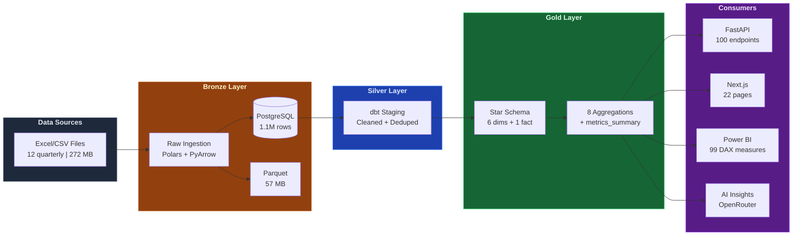
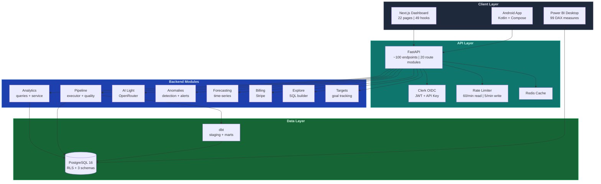
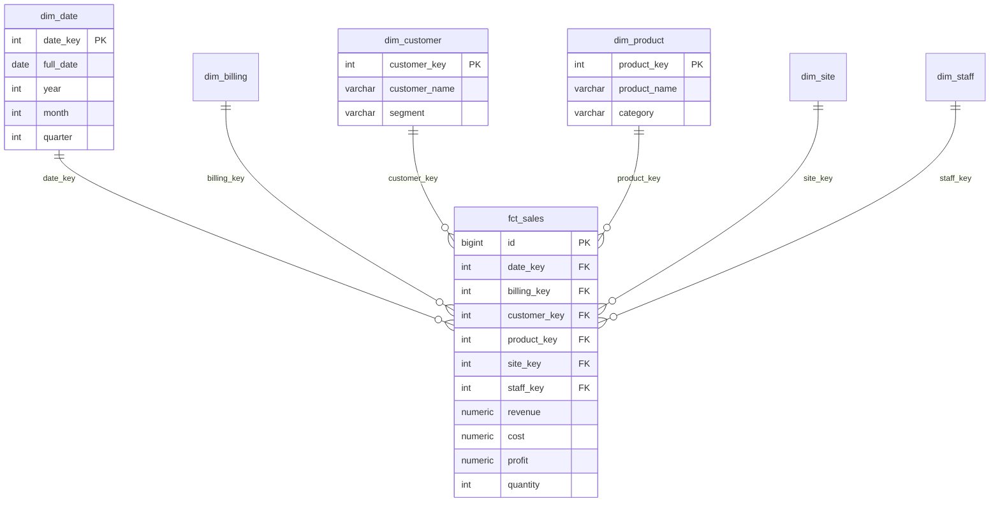

<p align="center">
  
</p>

<h1 align="center">
  
</h1>

<p align="center">
  <strong>Enterprise Sales Analytics Platform</strong><br/>
  <em>Import &rarr; Clean &rarr; Analyze &rarr; Visualize</em>
</p>

<p align="center">
  <a href="https://github.com/ahmed-shaaban-94/Data-Pulse/actions/workflows/ci.yml"></a>
  <a href="https://github.com/ahmed-shaaban-94/Data-Pulse/blob/main/LICENSE"></a>
  
  
  
  
</p>

---

## 

<p align="center">
  <a href="https://skillicons.dev">
    
  </a>
</p>

<p align="center">
  
  
  
  
  
  
</p>

<p align="center">
  
  
  
  
  
  
</p>

<p align="center">
  
  
  
  
  
  
</p>

---

## 

DataPulse is a full-stack data analytics platform that transforms raw sales data into actionable business intelligence. Built on the **medallion architecture** (Bronze / Silver / Gold), it processes **1.1M+ sales transactions** through a structured pipeline with automated quality gates, AI-powered insights, anomaly detection, forecasting, and interactive dashboards.

### Data Pipeline Flow



### System Architecture



---

## 

### Prerequisites

- [Docker Desktop](https://www.docker.com/products/docker-desktop/) 
- [Git](https://git-scm.com/) 

### Setup

```bash
# Clone the repository
git clone https://github.com/ahmed-shaaban-94/Data-Pulse.git
cd SAAS

# Configure environment
cp .env.example .env
# Edit .env with your passwords (see comments in file)

# Launch all services
make up
```

### Load Data & Build Pipeline

```bash
# Import raw sales data (Bronze layer)
make load

# Run dbt transforms (Silver + Gold layers)
make dbt

# Or run everything at once
make demo
```

---

## 

| Service | URL | Description |
|:--------|:----|:------------|
|  | [`localhost:3000`](http://localhost:3000) | Interactive analytics dashboard |
|  | [`localhost:8000/docs`](http://localhost:8000/docs) | FastAPI with Swagger docs |
|  | Clerk (managed) | Authentication & SSO |
|  | `localhost:5432` | Database (internal) |
|  | internal | Cache layer |

---

## 

### Medallion Data Pipeline

| Layer | Schema | Purpose | Technology |
|:------|:-------|:--------|:-----------|
|  | `bronze` | Raw data as-is from source | Polars + PyArrow + fastexcel |
|  | `public_staging` | Cleaned, deduplicated, type-cast | dbt staging models (7 tests) |
|  | `public_marts` | Aggregated, business-ready | dbt marts models (~40 tests) |

### Gold Layer Schema



### Tech Stack Details

| Layer | Technology | Role |
|:------|:-----------|:-----|
|  | Polars + PyArrow + fastexcel | High-performance data processing |
|  | PostgreSQL 16 + RLS | Tenant-scoped relational storage |
|  | dbt-core + dbt-postgres | SQL-first data transformation |
|  | FastAPI + SQLAlchemy 2.0 + Pydantic | REST API with validation |
|  | Next.js 15 + TypeScript + Tailwind | Server-rendered dashboard |
|  | Recharts | Interactive data visualization |
|  | Clerk + PyJWT | OAuth2/OIDC authentication |
|  | OpenRouter + anomaly detection | AI insights and forecasting |
|  | Power BI (99 DAX measures) | Advanced business intelligence |
|  | Redis | Response caching layer |
|  | GitHub Actions | Automated testing and deployment |
|  | Nginx + Cloudflare TLS | Production reverse proxy |

---

## 

```
.
├── src/datapulse/               # Python backend (135 files, 20+ modules)
│   ├── config.py                #   Pydantic settings
│   ├── logging.py               #   structlog configuration
│   ├── cache.py                 #   Redis caching layer
│   ├── bronze/                  #   Raw data ingestion (Excel -> PostgreSQL)
│   ├── import_pipeline/         #   Generic CSV/Excel reader + type detection
│   ├── analytics/               #   Core analytics (models, repository, service)
│   ├── pipeline/                #   Pipeline tracking + execution + quality gates
│   ├── ai_light/                #   AI insights via OpenRouter
│   ├── anomalies/               #   Statistical anomaly detection + calendar
│   ├── forecasting/             #   Time-series forecasting engine
│   ├── billing/                 #   Stripe subscriptions + usage metering
│   ├── targets/                 #   Goal tracking + target management
│   ├── explore/                 #   Self-service data exploration (SQL builder)
│   ├── reports/                 #   Custom report generation
│   ├── annotations/             #   Data annotations + notes
│   ├── notifications_center/    #   In-app notification system
│   ├── onboarding/              #   User onboarding flow
│   ├── views/                   #   Saved views + user preferences
│   ├── embed/                   #   Embeddable dashboard tokens
│   ├── watcher/                 #   File watcher (auto-trigger pipeline)
│   ├── tasks/                   #   Background task management
│   ├── core/                    #   Shared: config, db, security
│   └── api/                     #   FastAPI REST API
│       └── routes/              #     20 route files (~100 endpoints)
│
├── frontend/                    # Next.js 15 dashboard + marketing site
│   ├── src/app/
│   │   ├── (marketing)/         #   Landing page, pricing, legal
│   │   └── (app)/               #   Dashboard (14 analytics pages)
│   ├── src/components/          #   32 UI component directories
│   ├── src/hooks/               #   53 SWR data hooks
│   └── e2e/                     #   Playwright E2E tests (11 spec files)
│
├── dbt/models/                  # dbt transforms
│   ├── bronze/                  #   Source definitions
│   ├── staging/                 #   Silver layer (cleaned, 7 tests)
│   └── marts/                   #   Gold layer (dims + facts + aggs, ~40 tests)
│
├── android/                     # Android app (Kotlin + Jetpack Compose)
├── migrations/                  # SQL migrations (22 files)
├── n8n/workflows/               # n8n workflow definitions (7 workflows)
├── nginx/                       # Nginx reverse proxy config
├── powerbi/                     # Power BI report + theme
├── tests/                       # Python unit tests (98 files, 1,342 functions)
├── docs/                        # Architecture, plans, reports
│
├── docker-compose.yml           # Development (7 services)
├── docker-compose.prod.yml      # Production
├── Makefile                     # Developer commands
└── pyproject.toml               # Python project config
```

---

## 

| Metric | Value |
|:-------|:------|
| **Source** | 12 quarterly Excel files (Q1 2023 -- Q4 2025) |
| **Transactions** |  |
| **Columns** | 46 raw -> 35 cleaned -> star schema |
| **Raw Size** | 272 MB (Excel) -> 57 MB (Parquet) |
| **Dimensions** | Product (17.8K), Customer (24.8K), Staff (1.2K), Site (2), Billing (11), Date (1,096) |

---

## 

The API exposes **~100 endpoints** across **20 route modules**:

<details>
<summary><b>Analytics</b> <code>/api/v1/analytics/</code> -- Core business metrics</summary>

| Method | Endpoint | Description |
|:-------|:---------|:------------|
| GET | `/summary` | KPI summary (revenue, orders, customers, AOV) |
| GET | `/trends/daily` | Daily sales trend |
| GET | `/trends/monthly` | Monthly sales with MoM/YoY growth |
| GET | `/products/top` | Top products by revenue |
| GET | `/customers/top` | Top customers by revenue |
| GET | `/staff/top` | Top staff by revenue |
| GET | `/sites` | Site comparison |
| GET | `/returns` | Return analysis |
| GET | `/products/{id}` | Product detail with trend |
| GET | `/customers/{id}` | Customer detail with trend |

</details>

<details>
<summary><b>Pipeline</b> <code>/api/v1/pipeline/</code> -- Data pipeline operations</summary>

| Method | Endpoint | Description |
|:-------|:---------|:------------|
| POST | `/trigger` | Trigger full pipeline run |
| POST | `/execute/bronze` | Execute bronze stage |
| POST | `/execute/staging` | Execute dbt staging |
| POST | `/execute/marts` | Execute dbt marts |
| GET | `/runs` | List pipeline runs |
| GET | `/runs/{id}` | Get run details |
| GET | `/quality` | Get quality check results |
| POST | `/quality-check` | Run quality checks |

</details>

<details>
<summary><b>AI Insights</b> <code>/api/v1/insights/</code> -- AI-powered analysis</summary>

| Method | Endpoint | Description |
|:-------|:---------|:------------|
| GET | `/anomalies` | Detect statistical anomalies |
| GET | `/summary` | AI-generated narrative summary |
| GET | `/trends` | AI trend analysis |
| GET | `/recommendations` | AI business recommendations |

</details>

<details>
<summary><b>Additional Modules</b> -- 15+ more route groups</summary>

| Route Group | Description |
|:------------|:------------|
| `/api/v1/anomalies/` | Anomaly detection with calendar-aware alerting |
| `/api/v1/forecasting/` | Time-series forecasting |
| `/api/v1/targets/` | Goal tracking and target management |
| `/api/v1/explore/` | Self-service data exploration |
| `/api/v1/reports/` | Custom report generation |
| `/api/v1/billing/` | Stripe subscription management |
| `/api/v1/annotations/` | Data annotations and notes |
| `/api/v1/notifications/` | In-app notification center |
| `/api/v1/onboarding/` | User onboarding flow |
| `/api/v1/views/` | Saved views and preferences |
| `/api/v1/search/` | Global search across entities |
| `/api/v1/embed/` | Embeddable dashboard tokens |
| `/api/v1/export/` | Data export (CSV, Excel) |
| `/api/v1/dashboard-layouts/` | Custom dashboard layouts |
| `/api/v1/queries/` | Saved SQL queries |

</details>

---

## 

| Page | Path | Description |
|:-----|:-----|:------------|
| **Dashboard** | `/dashboard` | KPI overview with sparklines and comparison |
| **Products** | `/products` | Product analytics with hierarchy drill-down |
| **Customers** | `/customers` | Customer analytics with health scores |
| **Staff** | `/staff` | Staff performance metrics |
| **Sites** | `/sites` | Site comparison and breakdown |
| **Returns** | `/returns` | Return analysis and trends |
| **Pipeline** | `/pipeline` | Pipeline monitoring and run history |
| **Insights** | `/insights` | AI-powered insights and anomalies |
| **Alerts** | `/alerts` | Anomaly alerts and notifications |
| **Goals** | `/goals` | Target tracking and goal management |
| **Reports** | `/reports` | Custom report builder |
| **Custom Report** | `/custom-report` | Ad-hoc report generation |
| **Billing** | `/billing` | Subscription management |
| **Landing Page** | `/` | Marketing site with pricing and waitlist |

---

## 

```bash
# Start services
make up                  # Build and start all services
make dev                 # Start + print access URLs
make status              # Show service health

# Testing
make test                # Python tests with coverage (~79% unit, gated at 77%)
make test-e2e            # Playwright E2E tests
make dbt-test            # dbt model tests

# Code quality
make lint                # Ruff linter
make fmt                 # Ruff formatter

# Data pipeline
make load                # Import raw Excel/CSV data
make dbt                 # Run dbt build (staging + marts)
make pipeline            # Trigger full pipeline via API

# Database
make backup              # Backup PostgreSQL database
make restore             # Restore from backup

# Cleanup
make clean               # Stop services, remove volumes
```

---

## 

| Workflow | Trigger | Jobs |
|:---------|:--------|:-----|
|  | Push/PR to `main` | Lint, Type Check, Test (95%+ coverage gate) |
|  | Scheduled | Dependency vulnerability scanning |
|  | Manual | Deploy to staging environment |
|  | Manual | Deploy to production |
|  | Dependabot PR | Auto-merge minor/patch updates |

---

## 

- **Authentication**: Clerk OIDC with JWT validation (multi-strategy: Bearer JWT + API Key + dev fallback)
- **Authorization**: Tenant-scoped Row Level Security (RLS) on all data layers
- **API Security**: Rate limiting (60/min analytics, 5/min mutations), CORS whitelist
- **Data Protection**: SQL column whitelist, `NUMERIC(18,4)` for financials
- **Headers**: X-Content-Type-Options, X-Frame-Options, Referrer-Policy
- **Secrets**: All credentials via `.env` (never hardcoded)
- **Network**: Docker ports bound to `127.0.0.1` only

See [SECURITY.md](./SECURITY.md) for vulnerability reporting.

---

## 

| Phase | Status | Description |
|:------|:------:|:------------|
| **1.1** Foundation |  | Docker, Python env, import pipeline |
| **1.2** Bronze Layer |  | 1.1M rows loaded into PostgreSQL |
| **1.3** Silver Layer |  | Cleaned, normalized, 7 dbt tests |
| **1.4** Gold Layer |  | Star schema, 6 dims + 1 fact + 8 aggs |
| **1.5** Dashboard |  | Next.js 15, 22 pages, Recharts, E2E |
| **1.6** Polish |  | Security audit, 95%+ coverage |
| **2.0-2.7** Automation |  | n8n, pipeline tracking, quality gates |
| **2.8** AI-Light |  | OpenRouter insights, anomaly detection |
| **3.0** Enhancements |  | Theme, date picker, print, mobile |
| **4.0** Public Website |  | Landing page, pricing, SEO, waitlist |
| **The Great Fix** |  | 10 CRITICAL + 29 HIGH resolved |
| **Enh. 2-3** |  | Comparison, i18n, sparklines, search |

### Roadmap

| Phase | Description |
|:------|:------------|
| **5**  | Multi-tenancy & Billing -- Stripe subscriptions, usage metering |
| **6**  | Data Connectors -- Google Sheets, MySQL/SQL Server, Shopify |
| **7**  | Self-Service Analytics -- dashboard builder, scheduled reports |
| **8**  | AI & Intelligence -- NL queries (AR/EN), forecasting, ML |
| **9**  | Collaboration & Teams -- comments, sharing, workspaces |
| **10**  | Scale & Infra -- S3/MinIO, Celery, Kubernetes, Prometheus |

---

## 

<p align="center">

| Metric | Count |
|:-------|------:|
| Python source files | 135 |
| Backend modules | 20+ |
| API endpoints | ~100 |
| Frontend pages | 14 |
| SWR hooks | 53 |
| UI components | 32 dirs |
| SQL migrations | 22 |
| Test files | 98 |
| Test functions | 1,342 |
| Code coverage (unit) | ~79% (gated 77%) |
| dbt models | 16 |
| dbt tests | ~47 |
| E2E specs | 11 |
| DAX measures | 99 |

</p>

---

## 

| Document | Description |
|:---------|:------------|
| [docs/ARCHITECTURE.md](./docs/ARCHITECTURE.md) | System architecture with Mermaid diagrams |
| [docs/plans/](./docs/plans/) | Phase plans organized by topic |
| [docs/reports/](./docs/reports/) | Project reviews, audits, and post-mortems |
| [CLAUDE.md](./CLAUDE.md) | Full technical reference |
| [CONTRIBUTING.md](./CONTRIBUTING.md) | Development setup and code standards |
| [SECURITY.md](./SECURITY.md) | Security policy and vulnerability reporting |
| [CHANGELOG.md](./CHANGELOG.md) | Version history |

---

## License

This project is licensed under the MIT License -- see [LICENSE](./LICENSE) for details.

---

<p align="center">
  <sub>Built by <a href="https://github.com/ahmed-shaaban-94">Ahmed Shaaban</a></sub>
</p>

<p align="center">
  
</p>
