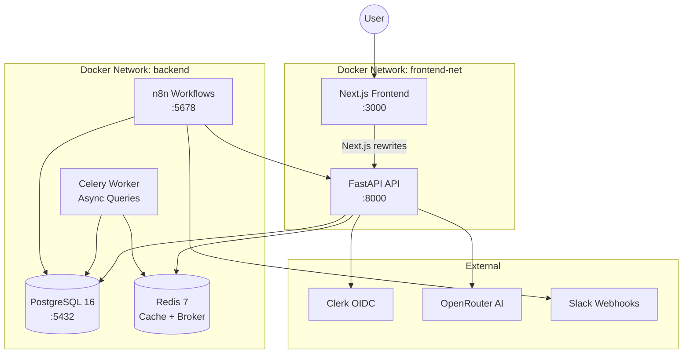
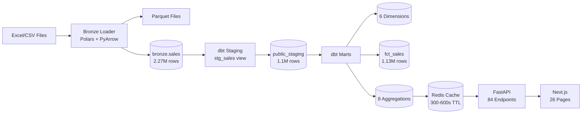
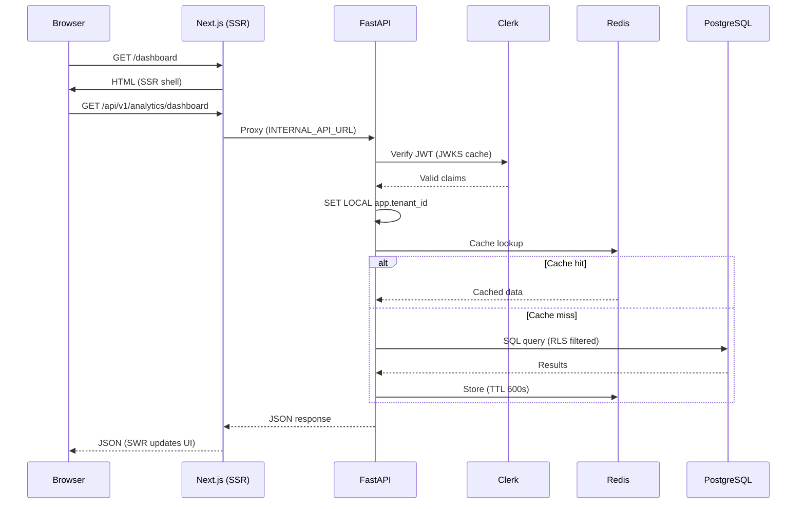
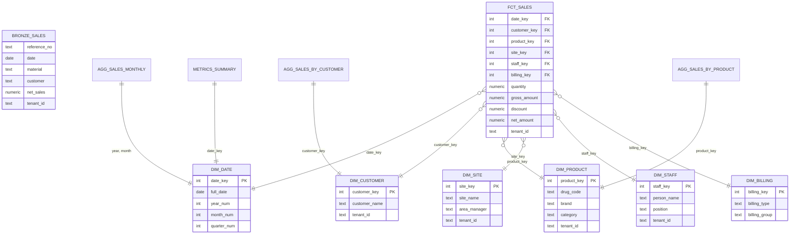
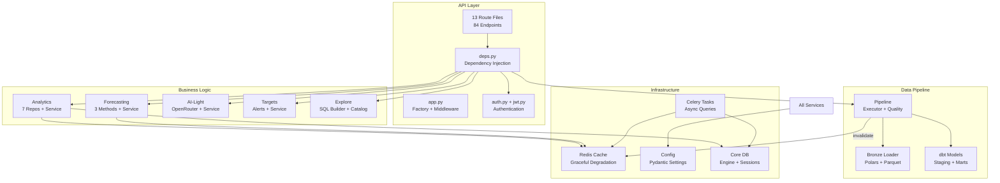
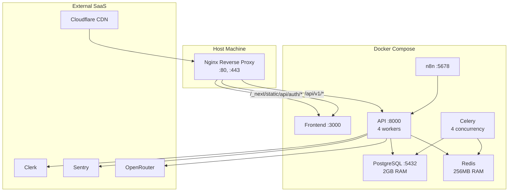

# DataPulse — System Architecture

## High-Level Overview



## Data Flow



## Request Flow (API Call)



## Database Schema (ERD)



## Module Dependency Map



## Deployment Architecture



## Security Architecture

### Multi-Tenant Row-Level Security (RLS)

```
JWT Token → tenant_id claim → SET LOCAL app.tenant_id → PostgreSQL RLS Policy
```

Every table with `tenant_id` has:
```sql
ALTER TABLE <table> ENABLE ROW LEVEL SECURITY;
ALTER TABLE <table> FORCE ROW LEVEL SECURITY;
CREATE POLICY tenant_isolation ON <table>
    FOR ALL USING (tenant_id::text = current_setting('app.tenant_id', true));
```

### Auth Flow
1. **Browser** → Clerk login → JWT token (template `datapulse` emits `tenant_id` + `roles`)
2. **Next.js** → `@clerk/nextjs` session → Bearer header
3. **FastAPI** → Verify JWT (JWKS) → Extract tenant_id
4. **PostgreSQL** → `SET LOCAL app.tenant_id` → RLS filters all queries

### API Security Layers
- CORS: restricted origins + headers
- Rate limiting: 5-60 req/min per endpoint
- Security headers: CSP, X-Frame-Options, X-Content-Type-Options
- SQL: parameterized queries only (whitelist for dynamic identifiers)
- Input: Pydantic validation on all inputs
- Errors: sanitized (no stack traces, paths, or connection strings)

## Tech Stack Summary

| Layer | Technology | Version |
|-------|-----------|---------|
| API | FastAPI + Uvicorn | ≥0.111, 4 workers |
| ORM | SQLAlchemy (raw SQL via text()) | 2.0 |
| Validation | Pydantic | ≥2.5 |
| Database | PostgreSQL + RLS | 16 |
| Cache | Redis | 7 |
| Async Tasks | Celery | ≥5.3 |
| Data Pipeline | Polars + PyArrow + dbt | ≥1.0, ≥1.8 |
| Forecasting | statsmodels | ≥0.14 |
| AI | OpenRouter (free tier) | - |
| Auth | Clerk OIDC + PyJWT | - |
| Frontend | Next.js 15 + TypeScript | ^15.3.0 |
| State | SWR + React Context | 2.3.3 |
| Charts | Recharts | 2.15.3 |
| Styling | Tailwind CSS | 3.4.17 |
| Monitoring | Sentry + structlog | ≥2.0 |
| Automation | n8n | 2.13.4 |
| CI | GitHub Actions | 6 jobs |
