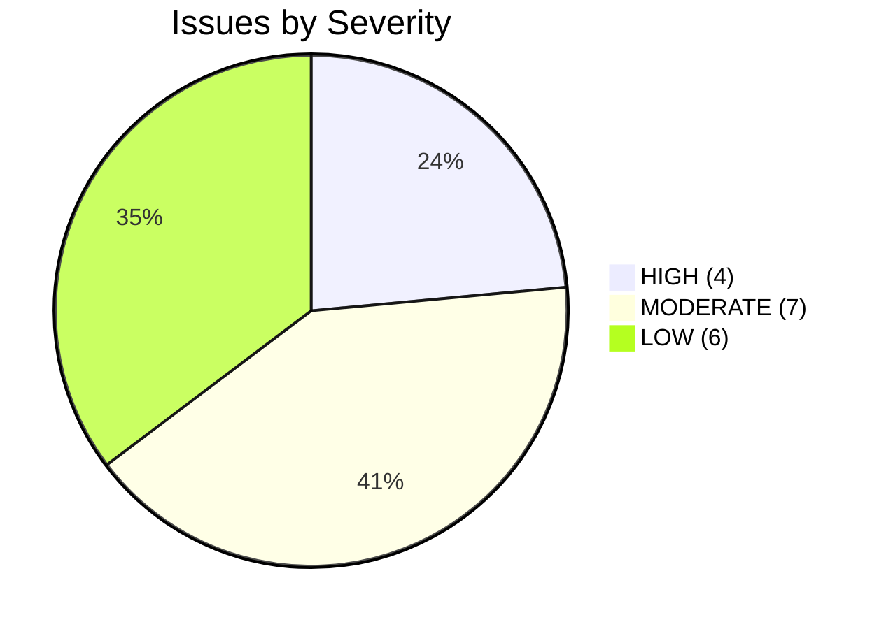
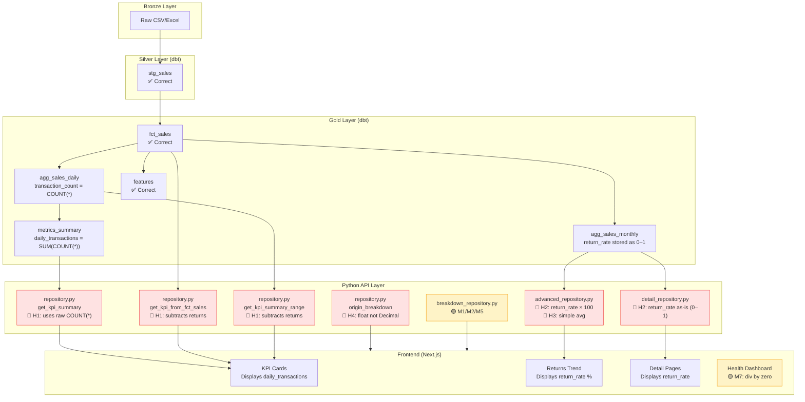
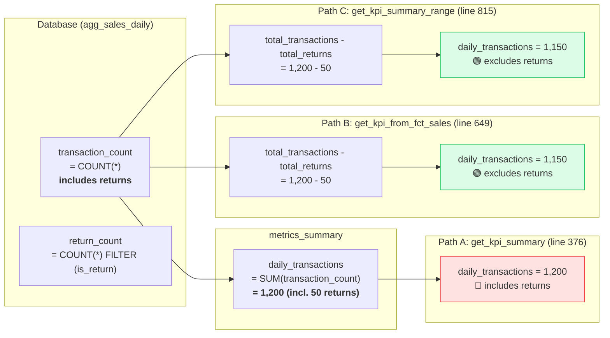
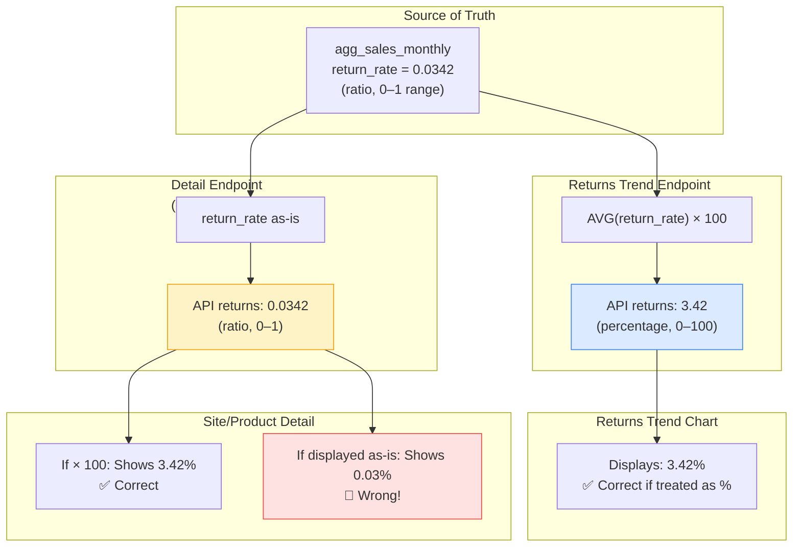
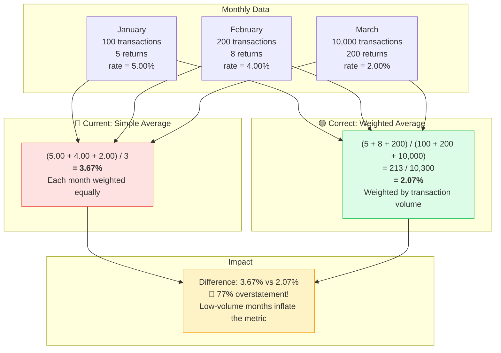
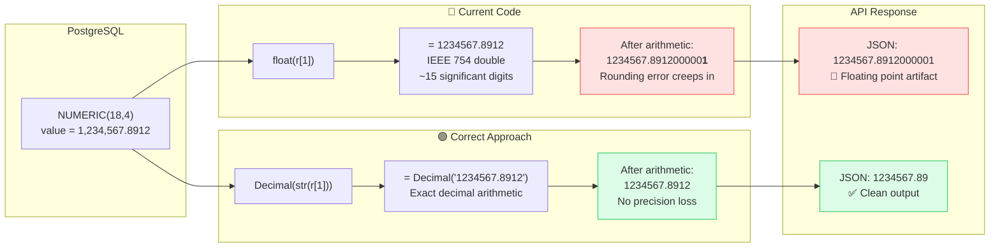

# DataPulse — Calculation Logic Audit Report

**Date:** 2026-04-07
**Scope:** All calculation logic across Python backend, dbt SQL models, and Next.js frontend
**Files Audited:** 40+ files across `src/datapulse/`, `dbt/models/`, `frontend/src/`

---

## Executive Summary

The audit found **4 HIGH severity**, **7 MODERATE severity**, and **6 LOW severity** issues across the full stack. The codebase demonstrates strong patterns overall (consistent NULLIF division protection in SQL, proper Decimal usage in Python, solid null coalescing in TypeScript), but has calculation inconsistencies between code paths and some precision/unit mismatches.

---

## Issue Severity Distribution



---

## Data Flow Overview — Where Issues Live



---

## HIGH Severity Issues

### H1: `daily_transactions` Calculated Inconsistently Across Code Paths

**Files:**
- `src/datapulse/analytics/repository.py:376` (metrics_summary path)
- `src/datapulse/analytics/repository.py:649` (fct_sales fallback path)
- `src/datapulse/analytics/repository.py:815` (range query path)

#### How the Inconsistency Happens



**Problem:**
The metrics_summary code path reads `daily_transactions` directly from the database, which is `COUNT(*)` in `agg_sales_daily` — **including returns**. But the fct_sales and range query paths compute `daily_transactions = total_transactions - total_returns`, **excluding returns**.

```python
# metrics_summary path (line 376) — includes returns
daily_transactions=daily_transactions,  # raw from DB: COUNT(*)

# fct_sales path (line 649) — excludes returns
daily_transactions=total_transactions - total_returns,
```

**Impact:** KPI dashboard shows different transaction counts depending on which code path is triggered by date range/data availability. The same day could show 1,200 or 1,150 transactions depending on the query path.

**Fix:** Standardize to one definition. Recommended: always subtract returns (net transactions) in all paths, including the metrics_summary path at line 376.

---

### H2: Return Rate Unit Inconsistency (0-1 vs 0-100)

**Files:**
- `src/datapulse/analytics/advanced_repository.py:192` — multiplies by 100
- `src/datapulse/analytics/detail_repository.py:336` — keeps as 0-1 decimal

#### Unit Mismatch Across Endpoints



**Problem:**
```sql
-- advanced_repository.py line 192: returns 0-100 range
ROUND(AVG(return_rate) * 100, 2) AS return_rate

-- detail_repository.py line 336: returns 0-1 range
return_rate=Decimal(str(row["return_rate"])).quantize(Decimal("0.0001"))
```

The `agg_sales_monthly.return_rate` column stores values as 0-1 decimals (e.g., 0.0342 = 3.42%). The returns trend endpoint multiplies by 100 before returning, but the detail endpoints pass the raw value.

**Impact:** Frontend components may display incorrect percentages if they multiply a pre-multiplied value by 100 again, or display raw decimals that should be percentages.

**Fix:** Choose one convention and apply everywhere. Recommended: store/transmit as 0-1, multiply by 100 only at display time in the frontend.

---

### H3: Average Return Rate Uses Simple Average Instead of Weighted Average

**File:** `src/datapulse/analytics/advanced_repository.py:219-221`

#### Simple vs Weighted Average — Numerical Example



**Problem:**
```python
avg_rate = (
    Decimal(sum(p.return_rate for p in points) / len(points)).quantize(Decimal("0.01"))
    if points else _ZERO
)
```

This averages monthly return rates arithmetically. A month with 100 transactions and 5% return rate is weighted equally with a month with 10,000 transactions and 2% return rate.

**Correct formula:** `total_returns_across_months / total_transactions_across_months * 100`

**Impact:** Overstatement of return rate when low-volume months have higher return rates (common seasonal pattern).

---

### H4: Origin Breakdown Returns Float Instead of Decimal

**File:** `src/datapulse/analytics/repository.py:916-925`

#### Precision Loss Chain



**Problem:**
```python
total = sum(float(r[1]) for r in rows)  # float
return [
    {
        "origin": str(r[0]),
        "value": float(r[1]),          # float — precision loss
        "pct": round(float(r[1]) / total * 100, 1) if total else 0,
    }
    for r in rows
]
```

All other analytics endpoints use `Decimal` for financial values. This endpoint uses `float`, causing potential precision loss on large amounts and inconsistency in the API contract.

**Fix:** Use `Decimal(str(r[1]))` and `JsonDecimal` type.

---

## MODERATE Severity Issues

### M1: Transaction Count Netting Assumes 2:1 Return Ratio

**File:** `src/datapulse/analytics/breakdown_repository.py:50`

```sql
SUM(a.transaction_count) - 2 * SUM(a.return_count) AS transaction_count,
```

Subtracts `2 * return_count` from `transaction_count`. This assumes each return also had an original sale counted in `transaction_count` (so you subtract once for the return row and once for the original). If returns are standalone credit notes, this over-subtracts.

---

### M2: Silent Fallback When All Values Are Negative

**File:** `src/datapulse/analytics/breakdown_repository.py:64`

```python
grand_total = sum(v for _, _, v in raw) or Decimal("1")
```

If all sales are returns (negative total), `grand_total` becomes `Decimal("1")`, silently producing nonsensical percentages.

---

### M3: `safe_growth()` Returns None for Infinite Growth

**File:** `src/datapulse/analytics/queries.py:119-123`

```python
def safe_growth(current: Decimal, previous: Decimal) -> Decimal | None:
    if previous == _ZERO:
        return None
```

When a product/customer goes from 0 to any value, growth is undefined. Some callers handle `None` gracefully, others may not. The behavior should be documented.

---

### M4: ABC Cumulative % Rounding at Classification Boundaries

**File:** `src/datapulse/analytics/advanced_repository.py:66, 151`

Cumulative percentage is calculated in SQL with floating-point then rounded to 2 decimals in Python. ABC thresholds (80%, 95%) are applied after rounding, so edge-case products near boundaries (e.g., 79.995%) may shift classification.

---

### M5: Customer Type `other_count` Can Go Negative

**File:** `src/datapulse/analytics/breakdown_repository.py:106`

```python
other_count=int(r[3]) - int(r[1]) - int(r[2]),
```

No validation that `walk_in_count + insurance_count <= total_count`. Data quality issues could produce negative `other_count`.

---

### M6: `feat_customer_health.sql` Recomputes Weighted Score

**File:** `dbt/models/marts/features/feat_customer_health.sql:160-173`

The health_score weighted formula (`recency * 0.30 + frequency * 0.25 + monetary * 0.25 + return * 0.10 + diversity * 0.10`) is computed once for `health_score` and then the entire expression is repeated 4 times in the `CASE WHEN` for `health_band`. Should reference the computed column instead.

---

### M7: Frontend Division by Zero in Health Dashboard

**File:** `frontend/src/components/customers/health-dashboard.tsx:41`

```typescript
style={{ width: `${(b.count / dist.total) * 100}%` }}
```

No guard for `dist.total === 0`. If all health bands are empty, produces `Infinity` or `NaN`.

**Fix:** `dist.total > 0 ? (b.count / dist.total) * 100 : 0`

---

## LOW Severity Issues

### L1: Percentage Rounding Inconsistency Across Endpoints

Different Python endpoints use different decimal places for percentages:
- `queries.py`: 2 decimals (`Decimal("0.01")`)
- `repository.py:922`: 1 decimal (`round(..., 1)`)
- `detail_repository.py:336`: 4 decimals (`Decimal("0.0001")`)

Recommendation: Standardize to 2 decimals for all percentage API fields.

---

### L2: dbt Aggregation Quantity Precision Inconsistency

- `agg_sales_daily.sql:28` uses `::NUMERIC(18,4)` for quantity
- `agg_sales_by_site.sql:30` and `agg_sales_by_staff.sql:30` use `ROUND(..., 2)::NUMERIC`

Recommendation: Standardize to `::NUMERIC(18,4)` across all aggregations.

---

### L3: Frontend `formatCompact()` Inconsistent Decimals

**File:** `frontend/src/lib/formatters.ts:33-37`

Millions formatted with 1 decimal (`1.2M`), thousands with 0 (`12K`). Minor cosmetic inconsistency.

---

### L4: Calendar Heatmap Color Ratio Not Clamped

**File:** `frontend/src/components/dashboard/calendar-heatmap.tsx:8-14`

```typescript
const ratio = (value - min) / (max - min);
```

If `value` falls outside `[min, max]`, `ratio` goes outside `[0, 1]`, causing opacity outside valid range. Add `Math.min(Math.max(ratio, 0), 1)`.

---

### L5: Data Freshness Doesn't Handle Future Timestamps

**File:** `frontend/src/components/shared/data-freshness.tsx:11`

`getMinutesAgo()` could return negative values for future timestamps. Add `Math.max(minutesAgo, 0)`.

---

### L6: Custom Report `formatCell` No Type Guard

**File:** `frontend/src/components/custom-report/report-results.tsx:55-70`

Calls `.toLocaleString()` on `unknown` type without checking `typeof value === "number"`.

---

## Correct Patterns (No Issues Found)

These areas were audited and found to be correctly implemented:

| Area | Details |
|------|---------|
| **SQL Division Protection** | All dbt models consistently use `NULLIF(denominator, 0)` |
| **Multi-tenant Safety** | All JOINs include `tenant_id`; all aggregations `PARTITION BY tenant_id` |
| **Financial Precision** | Sales/discounts: `ROUND(..., 2)`; quantities: `NUMERIC(18,4)` |
| **Window Functions** | Correct `ROWS BETWEEN` frames in metrics_summary, rolling features |
| **Growth Rate Formulas** | MoM/YoY in `agg_sales_monthly` are correct with proper NULLIF |
| **RFM NTILE Scoring** | `feat_customer_segments.sql:56` — ORDER BY DESC gives higher score to more recent customers (correct) |
| **Product Lifecycle Phases** | `feat_product_lifecycle.sql:94-104` — dormant quarter logic with -1 buffer is correct |
| **Customer Health Scores** | Recency/frequency/monetary/return/diversity scoring logic is mathematically sound |
| **Seasonality Indices** | DOW and monthly indices correctly divided by grand average |
| **Rolling Averages** | 7/30/90-day windows correctly defined with `N-1 PRECEDING` |
| **Frontend Progress Rings** | SVG circumference and offset calculations are correct |
| **Frontend Return Gauge** | Scale normalization and angle interpolation are correct |
| **Frontend Animation** | Easing function and count-up interpolation are mathematically sound |
| **Comparison Period Dates** | Previous period calculation in both Python and TypeScript is correct |
| **Target Progress** | Division by zero guard and 0-100% clamping are properly implemented |

---

## Fix Priority Roadmap

```mermaid
gantt
    title Fix Priority — Recommended Order
    dateFormat X
    axisFormat %s

    section HIGH (Fix First)
    H1 daily_transactions consistency  :crit, h1, 0, 2
    H2 return_rate unit standard       :crit, h2, 0, 2
    H3 weighted avg return rate        :crit, h3, 0, 2
    H4 origin Decimal conversion       :crit, h4, 0, 1

    section MODERATE
    M7 health dashboard div/0          :m7, 2, 3
    M5 other_count validation          :m5, 2, 3
    M1 transaction netting docs        :m1, 3, 4
    M2 silent fallback guard           :m2, 3, 4
    M3 safe_growth docs                :m3, 3, 4
    M4 ABC rounding edge case          :m4, 4, 5
    M6 health_score refactor           :m6, 4, 5

    section LOW
    L1 percentage decimal standard     :l1, 5, 7
    L2 dbt quantity precision          :l2, 5, 7
    L3-L6 frontend minor fixes         :l3, 5, 7
```



## Recommendations Summary

| Priority | Action | Effort |
|----------|--------|--------|
| 1 | Standardize `daily_transactions` definition across all code paths (H1) | Small |
| 2 | Fix return rate unit consistency — always transmit as 0-1 (H2) | Small |
| 3 | Use weighted average for avg_return_rate (H3) | Small |
| 4 | Convert origin_breakdown to Decimal (H4) | Trivial |
| 5 | Add `dist.total > 0` guard in health-dashboard.tsx (M7) | Trivial |
| 6 | Validate `other_count >= 0` in customer breakdown (M5) | Trivial |
| 7 | Refactor health_score CASE to reference computed column (M6) | Small |
| 8 | Standardize percentage decimals across API (L1) | Medium |
