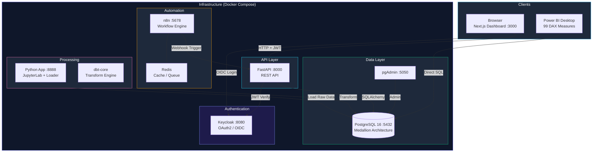
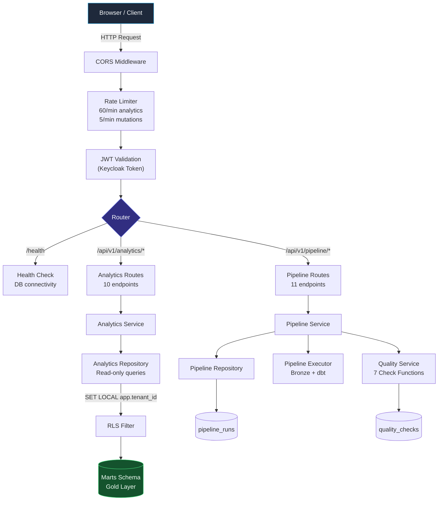
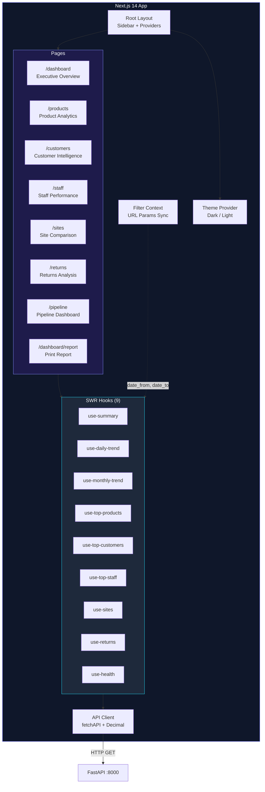
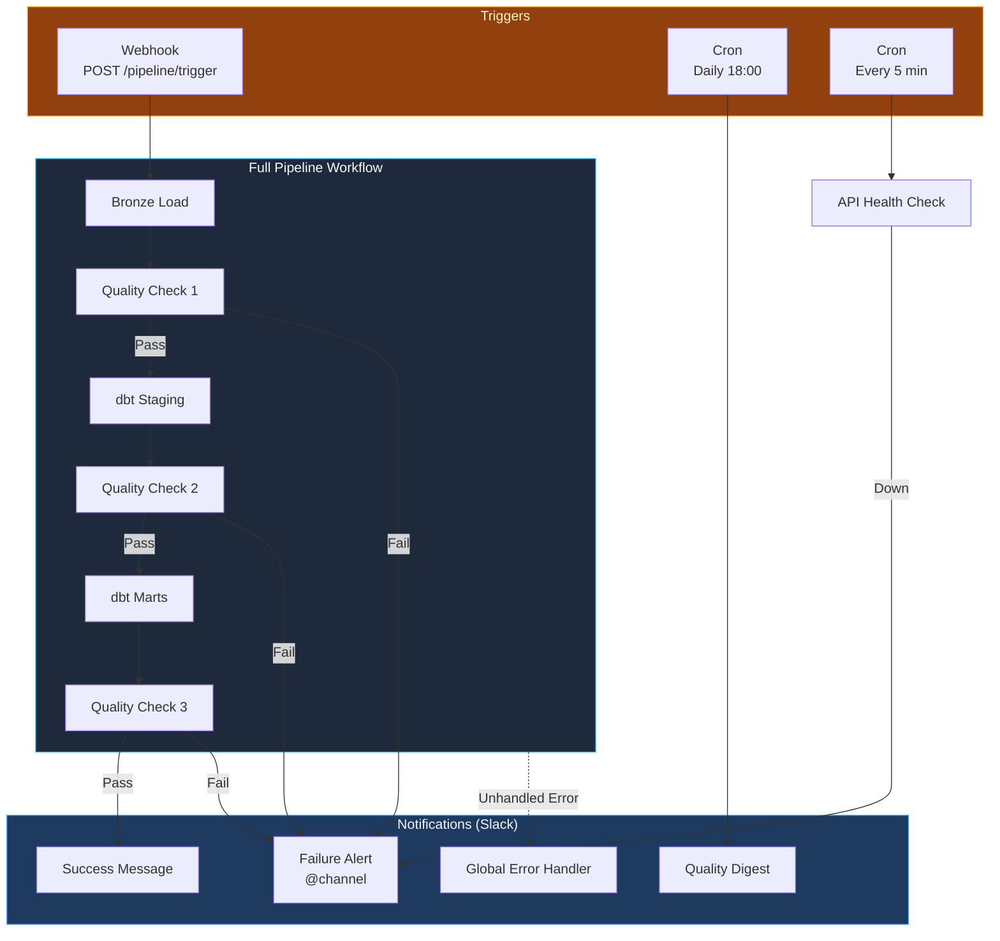
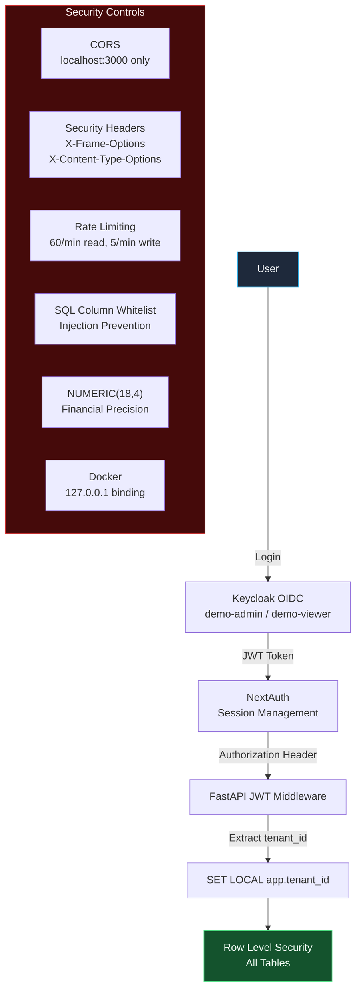
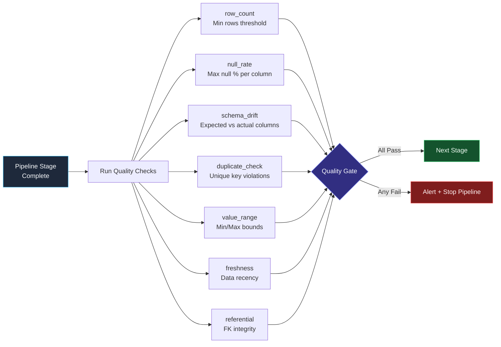

# DataPulse - Architecture Flowchart

## 1. High-Level System Architecture

## 2. Medallion Data Pipeline (Bronze -> Silver -> Gold)

```mermaid
flowchart LR
    subgraph SOURCE["Data Source"]
        EXCEL["Excel / CSV Files<br/>Raw Sales Data"]
    end

    subgraph BRONZE["Bronze Layer (Raw)"]
        LOADER["Python Loader<br/>Polars + PyArrow"]
        PARQUET["Parquet Files"]
        BRONZE_DB[("bronze.sales<br/>2.2M rows<br/>47 columns")]
    end

    subgraph SILVER["Silver Layer (Clean)"]
        DBT_STG["dbt: stg_sales<br/>Dedup + Clean"]
        SILVER_DB[("public_staging.stg_sales<br/>~1.1M rows<br/>35 columns")]
    end

    subgraph GOLD["Gold Layer (Business)"]
        DBT_MARTS["dbt: Marts Models"]
        subgraph DIMS["Dimensions"]
            DIM_DATE["dim_date (1,096)"]
            DIM_BILLING["dim_billing (11)"]
            DIM_CUSTOMER["dim_customer (24,801)"]
            DIM_PRODUCT["dim_product (17,803)"]
            DIM_SITE["dim_site (2)"]
            DIM_STAFF["dim_staff (1,226)"]
        end
        subgraph FACTS["Facts"]
            FCT_SALES["fct_sales<br/>1.1M rows"]
        end
        subgraph AGGS["Aggregations"]
            AGG_DAILY["agg_sales_daily"]
            AGG_MONTHLY["agg_sales_monthly"]
            AGG_PRODUCT["agg_sales_by_product"]
            AGG_CUSTOMER["agg_sales_by_customer"]
            AGG_SITE["agg_sales_by_site"]
            AGG_STAFF["agg_sales_by_staff"]
            AGG_RETURNS["agg_returns"]
            METRICS["metrics_summary"]
        end
    end

    EXCEL -->|"fastexcel"| LOADER
    LOADER -->|"Write"| PARQUET
    LOADER -->|"INSERT batch 50K"| BRONZE_DB
    BRONZE_DB -->|"dbt run"| DBT_STG
    DBT_STG --> SILVER_DB
    SILVER_DB -->|"dbt run"| DBT_MARTS
    DBT_MARTS --> DIMS
    DBT_MARTS --> FACTS
    DBT_MARTS --> AGGS
    DIMS --> FCT_SALES
    FCT_SALES --> AGGS

    style SOURCE fill:#92400e,stroke:#f59e0b,color:#fef3c7
    style BRONZE fill:#7c2d12,stroke:#fb923c,color:#fff7ed
    style SILVER fill:#1e3a5f,stroke:#60a5fa,color:#eff6ff
    style GOLD fill:#14532d,stroke:#4ade80,color:#f0fdf4
```

## 3. API Request Flow

## 4. Frontend Architecture

## 5. n8n Automation Workflows

## 6. Security Architecture

## 7. Quality Gate Flow

