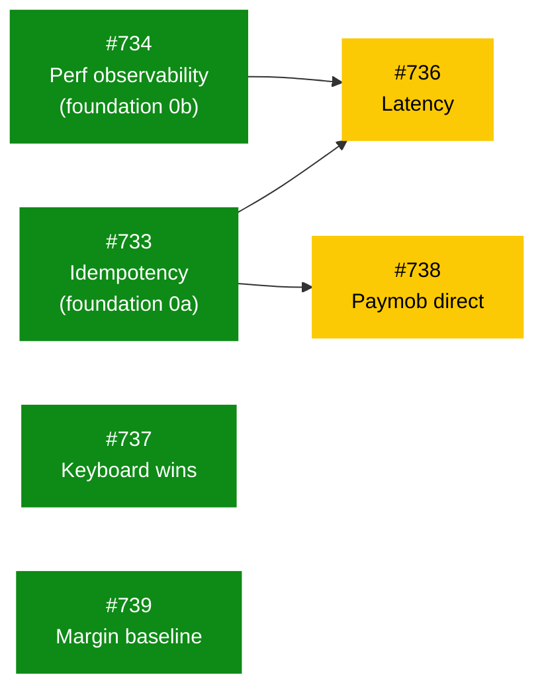

# POS Legend Strategy — North Star, Bets, and Roadmap

**Date:** 2026-04-25
**Author:** Claude (brainstorming session, branch `claude/fervent-nash-1ec7af`)
**Status:** Strategic direction locked by product owner. Implementation roadmap to follow.

Related: [[layers/frontend]] · [[layers/api]] · [[modules/pos]]
Prior: [[2026-04-22-pos-v9-feature-inventory]] · [[2026-04-23-pos-alpha-hardening-and-smoke-test]]

---

## TL;DR

> **Be the POS that makes pharmacies more profitable.**
> North star = gross-margin lift per basket. Win on a keyboard-fast UX, bulletproof offline, and an AI tier that competitors can't replicate. Compliance stays configurable, not productized.

---

## Locked answers (10/10)

| # | Pick | Direction |
|---|------|-----------|
| Q1 | **C** | North star = **gross-margin lift per basket** |
| Q2 | **A** | 4-week obsession = **scan-to-cart <120ms p95** |
| Q3 | **B** | UX = **keyboard-first**, every action hotkeyed |
| Q4 | **B** | Offline = **full + optimistic sync + auto-resolve** |
| Q5 | **B** | Pricing = **Pro/Legend AI tiers** |
| Q6 | **A + C** | Hardware = **polish existing + Paymob/EMV direct** |
| Q7 | **E** | Compliance = **configurable, not productized** |
| Q8 | **B** | SLO = **99.95% / <200ms p95 / "no single failure blocks a sale"** |
| Q9 | **A** | First AI feature = **real-time MBA upsell at cart-add** |
| Q10 | **D** | Extensibility = **headless POS API + reference UI** |

## Why this set is coherent

- **Q1-C + Q5-B + Q9-A** form one thesis: intelligence is the moat. Margin lift is the metric, an AI tier is the pricing capture, MBA is the first proof point.
- **Q2-A + Q3-B + Q8-B** form the trust layer: snappy, predictable, never blocks a sale. Without this the AI tier won't be tolerated.
- **Q4-B + Q6-A/C** address Egyptian-pharma reality: connectivity is unreliable, payments are fragmented. Auto-resolving sync + direct Paymob/EMV remove two huge classes of friction.
- **Q7-E + Q10-D** are deliberate non-goals: compliance is local/brittle and not where we differentiate; extensibility comes via API not plugins.

## Alternatives considered & rejected

- **Compliance moat (Q7-A)** — original recommendation. Rejected because regulatory differentiators are local to Egypt, slow to build trust, and don't compound. AI features compound across tenants.
- **Hardware-led differentiation (Q6-B drawer + customer display)** — rejected as "trust theater." Postponed until after the AI tier ships.
- **Speed/reliability as the north star (Q1-A or Q1-B)** — rejected as table stakes; necessary but not differentiating.
- **Plugin extensibility (Q10-B)** — rejected as premature; revisit at >100 tenants.

---

## Gap audit findings (2026-04-25)

Two parallel `Explore` agents audited backend (`src/datapulse/pos/*`) and frontend (`frontend/src/components/pos/*`, `frontend/src/lib/pos/*`) against the Q1 workstreams. Full reports retained in session transcript; key findings below.

### What's already in place
- TTL'd idempotency layer at [idempotency.py:22](src/datapulse/pos/idempotency.py:22), overload guard middleware, rate limits, structured logging.
- Payment provider abstraction at [payment.py:48](src/datapulse/pos/payment.py:48); CashGateway implemented; SplitPaymentProcessor done.
- PaymobClient exists in `src/datapulse/billing/paymob_client.py` — but NOT wired into pos/.
- Margin agg at product × month grain: `dbt_project/models/marts/aggs/agg_margin_analysis.sql`.
- Reason-tag taxonomy enum in [reason-tags.ts](frontend/src/components/pos/sync/reason-tags.ts).
- 6/10 POS modals already wire ESC+Enter via `ModalShell`.

### Five blockers (ranked)

| # | Finding | Workstreams blocked | Effort |
|---|---------|---------------------|--------|
| **B1** | `add_item` / `update_item` / `remove_item` lack `Idempotency-Key` support | 4, 6 | L |
| **B2** | `pos.transaction_items` has `unit_price` but no `cost_per_unit` → no per-basket margin | 5, Q2 MBA | L |
| **B3** | Zero runtime perf instrumentation (no web-vitals, no Lighthouse CI, no per-route p95 trackers) | 1, 6 | M |
| **B4** | `CardGateway` in `pos/payment.py` is a stub; PaymobClient lives in `billing/`, not wired | 3 | L |
| **B5** | Terminal page is one giant `useState` block → every keystroke re-renders ClinicalPanel + modals | 1 | L |

### Quick wins (sub-day each)
1. ESC + Enter on `ReconcileModal`, `VoidModal`, `ShiftOpenModal` (currently click-only)
2. Global `?` cheat-sheet overlay
3. Surface reason-tag classification inside `ReconcileModal`
4. Instrument reason-tag occurrence count
5. Per-operation timers inside `_service_cart`

---

## Roadmap

### Q1 (re-scoped post-audit) — "Foundation + Snappy + Connected"

The original Q1 was too ambitious given B1–B5. Re-scoped:

| Order | Issue | Workstream | Deliverable | Files of interest |
|-------|-------|------------|-------------|-------------------|
| **0a — foundation** | [#733](https://github.com/ahmed-shaaban-94/Data-Pulse/issues/733) | Fix B1: idempotency on cart mutations | `Idempotency-Key` dependency wrapped around `add_item`, `update_item`, `remove_item` endpoints | [_pos_transactions.py](src/datapulse/api/routes/_pos_transactions.py), [idempotency.py](src/datapulse/pos/idempotency.py) |
| **0b — foundation** | [#734](https://github.com/ahmed-shaaban-94/Data-Pulse/issues/734) | Fix B3: perf observability | web-vitals client beacon + Lighthouse CI in GH Actions + per-route p95 SLO middleware | [middleware.py](src/datapulse/api/bootstrap/middleware.py), `frontend/next.config.mjs`, new GH workflow |
| ~~**0c — foundation**~~ | ~~[#735](https://github.com/ahmed-shaaban-94/Data-Pulse/issues/735)~~ ✅ | ~~Revive staged desktop update rollouts~~ — **DONE via PR [#732](https://github.com/ahmed-shaaban-94/Data-Pulse/pull/732) + migration 115** (merged 24 min before this issue was created — own-goal, see post-audit decision-log entry) | (n/a) | (n/a) |
| 1 | [#736](https://github.com/ahmed-shaaban-94/Data-Pulse/issues/736) | Latency (Q2-A) — instrument first, then optimize | Per-op timers in `_service_cart`; React.memo on CartRow; ClinicalPanel Suspense boundary | [_service_cart.py](src/datapulse/pos/_service_cart.py), [CartRow.tsx](frontend/src/components/pos/terminal/CartRow.tsx), [ClinicalPanel.tsx](frontend/src/components/pos/terminal/ClinicalPanel.tsx) |
| 2 | [#737](https://github.com/ahmed-shaaban-94/Data-Pulse/issues/737) | Keyboard quick wins (Q3-B) | 5 quick-win items above; `?` cheat-sheet overlay component | [ReconcileModal.tsx](frontend/src/components/pos/ReconcileModal.tsx), [VoidModal.tsx](frontend/src/components/pos/VoidModal.tsx), [ShiftOpenModal.tsx](frontend/src/components/pos/terminal/ShiftOpenModal.tsx), new `ShortcutsCheatSheet.tsx` |
| 3 | [#738](https://github.com/ahmed-shaaban-94/Data-Pulse/issues/738) | Paymob direct (Q6-C) — long-lead, start week 1 | New `PaymobCardGateway(PaymentGateway)` in `pos/payment.py` adapting `billing/paymob_client.py`; sandbox cert in parallel | [payment.py](src/datapulse/pos/payment.py), [paymob_client.py](src/datapulse/billing/paymob_client.py) |
| 4 | [#739](https://github.com/ahmed-shaaban-94/Data-Pulse/issues/739) | Margin baseline (Q1-C) — schema first | Migration: add `cost_per_unit NUMERIC(18,4)` to `pos.transaction_items`; backfill from `fct_po_lines`; new `agg_basket_margin` (tenant × shift × cashier × txn) | new SQL migration, [models/cart.py](src/datapulse/pos/models/cart.py), new dbt model |

**Dropped from Q1, deferred to Q2 (or post-Q2):**
- Offline conflict auto-resolver (depends on Q1-row-0a being universal first)
- SLO chaos test harness (premature without complete idempotency coverage)
- "No single failure blocks a sale" full checklist (becomes meaningful after B1 closes)

### Dependency rule

> **A door opens when every arrow pointing at an issue has been merged.**
> Pick any ready issue. Don't start a blocked one until its incoming arrows are merged.

> **Note (post-audit, 2026-04-25)**: row 0c (#735 staged updates) was closed as already-done via PR #732. Removed from this graph.

**Wave order:**
| Wave | Trigger | Becomes ready |
|------|---------|---------------|
| 1 — day 1 | (none — 4 issues startable today) | [#733](https://github.com/ahmed-shaaban-94/Data-Pulse/issues/733), [#734](https://github.com/ahmed-shaaban-94/Data-Pulse/issues/734), [#737](https://github.com/ahmed-shaaban-94/Data-Pulse/issues/737), [#739](https://github.com/ahmed-shaaban-94/Data-Pulse/issues/739) |
| 2 | [#733](https://github.com/ahmed-shaaban-94/Data-Pulse/issues/733) merged | [#738](https://github.com/ahmed-shaaban-94/Data-Pulse/issues/738) |
| 3 | [#733](https://github.com/ahmed-shaaban-94/Data-Pulse/issues/733) **and** [#734](https://github.com/ahmed-shaaban-94/Data-Pulse/issues/734) merged | [#736](https://github.com/ahmed-shaaban-94/Data-Pulse/issues/736) |

### Q2 (weeks 14–26) — "Intelligence + Tiers"

| # | Workstream | Deliverable |
|---|------------|-------------|
| 7 | Real-time MBA (Q9-A) | server-side MBA on `add_to_cart`, top-3 upsell tiles inline, A/B framework with control group |
| 8 | Pricing tiers (Q5-B) | feature flags by tier (Basic/Pro/Legend); paywall UX; admin upgrade flow |
| 9 | Churn-save (Q9-B follow) | extend `ChurnAlertCard` with offer engine + acceptance tracking |
| 10 | Headless API polish (Q10-D) | versioned OpenAPI for POS endpoints, partner-docs site |
| 11 | Configurable compliance (Q7-E) | controlled-substance + insurance as opt-in modules, tenant toggles, no logic in core path |

---

## Risks

- **Paymob certification timeline** is the top schedule risk for Q1. Start the sandbox application week 1; do not block other workstreams on it.
- **Margin lift A/B** requires a clean control group; if Pro-tier AI is auto-on for everyone, we lose the ability to prove the metric and justify pricing.
- **Latency budget in CI** can flake; gate on p95 of last 50 builds, not single runs.
- **Q7-E "configurable not productized"** is correct *now* but must be revisited if a large chain demands a pre-built compliance pack — keep modules clean enough to extract later.
- **AI features without the trust layer** will be rejected. Order matters: ship Q1 (latency/offline/SLO) before turning on Q2 AI features.

## Tracking metric (definition)

**Gross-margin lift per basket** = `(observed margin per basket - rolling 28-day baseline) / baseline`,
computed per tenant, reported per cashier and per shift. Power BI page owns the dashboard.
A/B for AI features splits cashiers (not customers) within a tenant; control group sees no upsell tiles.

---

## Decision log

**2026-04-25** — Strategic direction locked above.
**2026-04-25 (later same day)** — Gap audit complete (parallel BE + FE Explore agents). Q1 re-scoped: foundation rows 0a (idempotency on cart mutations) + 0b (perf observability) prepended; offline conflict resolver and chaos-test harness moved out of Q1. See "Gap audit findings" section above.
**2026-04-25 (end of session)** — Row 0c added (revive PR #731 staged desktop update rollouts; branch preserved on remote). 7 GitHub issues created and linked in the table above ([#733](https://github.com/ahmed-shaaban-94/Data-Pulse/issues/733)–[#739](https://github.com/ahmed-shaaban-94/Data-Pulse/issues/739)) under label `epic:pos-legend`.
**2026-04-25 (post-audit)** — Audited recently-merged PRs and discovered: **row 0c was already done** before the issue was created (PR #732 + migration 115, merged 24 min before #735 was filed). Row 0c struck from the table; #735 to be closed. Also #677 (cross-epic prerequisite for row 0a) was already done via PR #730 + migration 114, so #733 has no remaining "doors" — moved from Wave 2 back to Wave 1 (day-1 startable). Lesson: always audit recently-merged PRs before scoping new issues. See [pos-master-roadmap](2026-04-25-pos-master-roadmap.md) for the cross-epic view.
**Reversible**: any pick can be revisited at the next quarterly planning if the tracking metric stalls.
