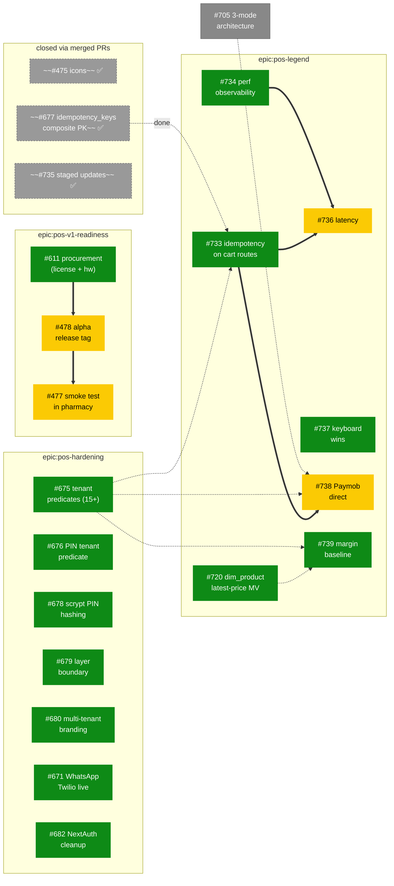

# POS Master Roadmap — All Epics, One View

**Date:** 2026-04-25
**Author:** Claude (post-audit consolidation, branch `claude/fervent-nash-1ec7af`)
**Status:** Authoritative for cross-epic POS planning until next quarterly review.

Related: [[layers/frontend]] · [[layers/api]] · [[modules/pos]]
Companion docs:
- [[2026-04-25-pos-legend-strategy]] — Legend epic detail (Q1 north-star, picks, gap audit)
- [[2026-04-22-pos-v9-feature-inventory]] — feature triage from v9 prototype
- [[2026-04-23-pos-alpha-hardening-and-smoke-test]] — alpha pilot decisions

---

## Why this doc exists

POS work was scattered across 4 GitHub epics with no single graph showing dependencies between them. Symptoms: silently-resolved issues stayed open (#475, #677, #735), prerequisites were rediscovered late (#677 unblocking #733), foundation work duplicated effort (#735 created 24 min after PR #732 merged the same change).

**This doc is the single source of truth** for: which epic owns what, what's actually open, what blocks what across epics, and what to start next.

---

## The four epics

| Epic | Scope | Status |
|------|-------|--------|
| `epic:pos-legend` | New strategic direction (north star = gross-margin lift per basket). 6 active Q1 issues (was 7, -#735). | Active — Wave 1 |
| `epic:pos-hardening` | Security + RLS + layer cleanup carried forward from alpha audit. 8 active issues (after labels applied). | Active — pick up alongside Legend |
| `epic:pos-v1-readiness` | Ship the desktop alpha. 2 active issues (#477 smoke test, #478 release tag). | Near-complete |
| `epic:pos-v9` (untagged) | v9 prototype features, mostly absorbed into Legend or shipped. Tracking issue #642 needs triage. | Triage |

---

## Master dependency graph

**Legend:** Solid `==>` = hard blocker. Dotted `-.->` = strong influence (work easier if done first). Greyed = closed.

---

## Wave order — across all 4 epics

| Wave | Trigger | Issues unlocked |
|------|---------|-----------------|
| **0 — start today** | (no doors) | [#733](https://github.com/ahmed-shaaban-94/Data-Pulse/issues/733), [#734](https://github.com/ahmed-shaaban-94/Data-Pulse/issues/734), [#737](https://github.com/ahmed-shaaban-94/Data-Pulse/issues/737), [#739](https://github.com/ahmed-shaaban-94/Data-Pulse/issues/739), [#720](https://github.com/ahmed-shaaban-94/Data-Pulse/issues/720), [#675](https://github.com/ahmed-shaaban-94/Data-Pulse/issues/675), [#676](https://github.com/ahmed-shaaban-94/Data-Pulse/issues/676), [#678](https://github.com/ahmed-shaaban-94/Data-Pulse/issues/678), [#679](https://github.com/ahmed-shaaban-94/Data-Pulse/issues/679), [#680](https://github.com/ahmed-shaaban-94/Data-Pulse/issues/680), [#671](https://github.com/ahmed-shaaban-94/Data-Pulse/issues/671), [#682](https://github.com/ahmed-shaaban-94/Data-Pulse/issues/682), [#611](https://github.com/ahmed-shaaban-94/Data-Pulse/issues/611) — **13 issues parallelizable** |
| 1 | [#733](https://github.com/ahmed-shaaban-94/Data-Pulse/issues/733) merged | [#738](https://github.com/ahmed-shaaban-94/Data-Pulse/issues/738) |
| 2 | [#733](https://github.com/ahmed-shaaban-94/Data-Pulse/issues/733) **and** [#734](https://github.com/ahmed-shaaban-94/Data-Pulse/issues/734) merged | [#736](https://github.com/ahmed-shaaban-94/Data-Pulse/issues/736) |
| 3 | [#611](https://github.com/ahmed-shaaban-94/Data-Pulse/issues/611) (drug-master license) cleared | [#478](https://github.com/ahmed-shaaban-94/Data-Pulse/issues/478) |
| 4 | [#478](https://github.com/ahmed-shaaban-94/Data-Pulse/issues/478) merged | [#477](https://github.com/ahmed-shaaban-94/Data-Pulse/issues/477) — needs human in pharmacy |

---

## The dependency rule (one rule, scaled across 4 epics)

> **A door opens when every solid arrow pointing at an issue has been merged.**
> Pick any ready issue. Don't start a blocked one until its incoming arrows are merged.
> Dotted arrows are guidance, not gates.

This is the same rule from the Legend doc — it scales because it's a topological-sort algorithm. Works no matter how big the graph gets.

---

## Recently closed (silent resolutions discovered 2026-04-25 audit)

| # | Closed via | Note |
|---|-----------|------|
| #475 | PR #674 | Icons regenerated via `pos-desktop/scripts/generate_icons.py` |
| #677 | PR #730 + migration 114 | Composite PK `(tenant_id, key)` on `pos.idempotency_keys` |
| #735 | PR #732 + migration 115 | Staged desktop updates — created 24 min after the work merged (own-goal) |

**Lesson learned**: before scoping new issues, audit recently-merged PRs (`gh pr list --state merged --limit 30`) for silent resolutions. Added to the dependency rule as a pre-flight check.

---

## Partially-resolved (still open, scope reduced)

These look done at first glance but have a tracked deferred-portion. Don't close them.

| # | What's done | What's still open |
|---|------------|-------------------|
| #676 | C5 (silent tenant_id=1 fallback) closed in #674 | C3 PIN-hash tenant predicate |
| #678 | Peppered HMAC-SHA256 in #674 | Proper scrypt + per-user salt |
| #680 | env-var letterhead module in #674 | Multi-tenant API fetch |
| #611 | Code-signing dropped (#476 closed); printer + scanner in hand | Drug-master DB license |
| #671 | Provider-agnostic scaffold in #669 | Live Twilio send |

---

## Triage-pending

- [#642](https://github.com/ahmed-shaaban-94/Data-Pulse/issues/642) — `[pos-v9/epic] POS v9 + Promotions — complete tracking`. No labels. Most v9 features are now in Legend or shipped — **needs owner decision** to close as superseded or label `epic:pos-hardening` for residual cleanup.
- [#705](https://github.com/ahmed-shaaban-94/Data-Pulse/issues/705) — 3-mode deployment architecture. Cross-cutting; not POS-pure. Linked here as influence on Legend Q5-B (pricing tiers).

---

## How to use this doc

- **Starting work?** Pick any green-status issue from Wave 0. Don't ask permission, just start.
- **Finishing an issue?** Re-check this graph — your closure may unlock a yellow/blocked one.
- **Adding a new issue?** First run `gh pr list --state merged --limit 30` to ensure it isn't already done. Then map its dependencies into the graph above.
- **Reviewing strategy?** This doc + [Legend strategy doc](2026-04-25-pos-legend-strategy.md) together are the source of truth.

---

## Decision log

**2026-04-25** — Master roadmap created. 9 missing epic labels applied (`epic:pos-hardening` ×7, `epic:pos-legend` ×1, `epic:pos-v1-readiness` ×1). 3 silently-resolved issues identified for closure (#475, #677, #735) — closures pending user permission. Tag `pos-desktop-v1.0.1` exists (alpha milestone effectively superseded — #478 is closeable too).
